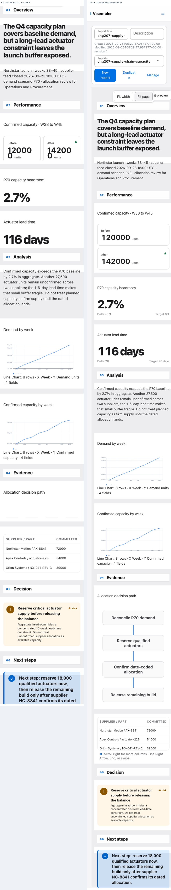

# CHG-207 R1 reader index

Project **visembler** · request **CHG-207-r1** · operation **FIX** · Fabric job **CF-044dc968600667a197348544**.

Candidate **`07011f61938510a525f8f9a1e747a3e1817520da`**, tree **`c33f29fcd911056c06b6be315170fbdac72beebd`**, based directly on **`5dfdd5eba77a45b63aa2e5290cb7609a573e9efc`**, tree **`d932f22966508ba6fdb630b6f66e1a01818b7b03`**. Scope is CHG-173 R2 F-RESP-01; CHG-206 PR #23 remains integrated and covered.

## 320px populated before/after — AR-73 failure class

[Original CHG-173 R2 320px evidence](screenshots/before/chg173-r2-supply-chain-320-before.png) · [Candidate 320px viewport](screenshots/320/supply-320-viewport.png) · [Candidate full reading order](screenshots/320/supply-320-full-page.png) · [Comparison values](screenshots/320/supply-320-comparison.png) · [Process Flow](screenshots/320/supply-320-process-flow.png) · [Evidence table affordance](screenshots/320/supply-320-wide-evidence-table.png).

The populated report shows Before **120000 units**, After **142000 units**, P70 headroom **2.7%**, and actuator lead time **116 days**. Geometry, line-wrap, pixel, and interaction data: [candidate 320/390/desktop diagnostics](diagnostics/geometry-token-wrap-flow-table.json) and [full browser receipt](receipts/chg207-populated-browser-acceptance.json).

## 390px and desktop regression

[390px viewport](screenshots/390/supply-390-viewport.png) · [390px full page](screenshots/390/supply-390-full-page.png) · [desktop viewport](screenshots/desktop/supply-desktop-viewport.png) · [desktop full report](screenshots/desktop/supply-desktop-full-page.png).

## Process Flow semantics

The narrow view is a reading projection of the unchanged canonical graph. At 320px the four allocation nodes are ordered top-to-bottom with all three directed edges. At 390px the same four nodes/three edges form a compact serpentine path. The receipt records IDs, labels, order, paths, geometry, accessible name, canonical direction, reading direction, model immutability, and pixels in the `flow` objects for each case.

## Table overflow, keyboard and accessibility proof

[320px table image](screenshots/320/supply-320-wide-evidence-table.png). At 320px the scroll region is 274px wide with 652px of table content; accessible name and description point to concise scroll instructions. The focused interaction receipt records ArrowRight `0→219`, End `219→378`, ArrowLeft `378→159`, Home `159→0`, with focus retained throughout; wheel `0→140`; touch `140→378`; and the non-overflow table (`274/274px`) has no cue. Details are under `focused_interactions` in the [CHG-207 browser receipt](receipts/chg207-populated-browser-acceptance.json).

Decision and Next steps are reachable in document order after the evidence table. Focus visibility, accessible state, browser errors, page geometry, and populated-pixel facts are included in the same receipt.

## Additional scenes and regression receipts

[Technical status/RCA at 320px](screenshots/technical/technical-320-full-page.png) · [weak numeric/comparison/table scenes](screenshots/weak-scenes/weak-scenes-320-full-page.png) · [200% zoom-equivalent](screenshots/zoom/supply-zoom-equivalent-200-full-page.png).

- [CHG-178 lifecycle/history/conflict](receipts/chg178-lifecycle-history-conflict.json): PASS, 5 cases.
- [CHG-179 semantic parity](receipts/chg179-semantic-parity.json): PASS.
- [CHG-180 Process Flow/wafer export](receipts/chg180-export-pptx.json): PASS. Its optional headless PPTX raster path is recorded MISSING because LibreOffice/soffice is unavailable; no raster-render pass is claimed.
- [CHG-181 authoring/composition/reuse](receipts/chg181-authoring-composition-reuse.json): PASS.
- [CHG-206 PPTX visible text](receipts/focused-regression-junit.xml) and the full native JUnit report: five CHG-206 tests passed in each selection.
- [Focused regression counts](diagnostics/test-summary.json); [complete maintained native release report](native-release/), including the 1,205-test JUnit XML and all native verification receipts.
- [Repository contracts](receipts/repository-contracts.json): PASS; managed target remains PENDING.

## Candidate, source, and bundle integrity

[Identity and changed-file hashes](identity.json) · [binary candidate patch](source/candidate.patch) · [changed-file receipt](source/changed-files.json) · [native release binding](diagnostics/native-release-binding.json) · [visual inspection record](visual-inspection.md).

The full evidence bundle is deterministic and has a sibling SHA-256 sidecar. `MANIFEST.sha256` hashes all payload files; `MANIFEST.sha256.sha256` binds that manifest. The report is local internal pilot evidence only; it is not company-managed target certification. CHG-208, CHG-209, CHG-173 final outcome, and CHG-21 certification are outside this request.

Artifact Bridge / Artifact Run tools were not available in the current tool catalog. The complete hash-bound evidence is carried on the two requested Git refs.
