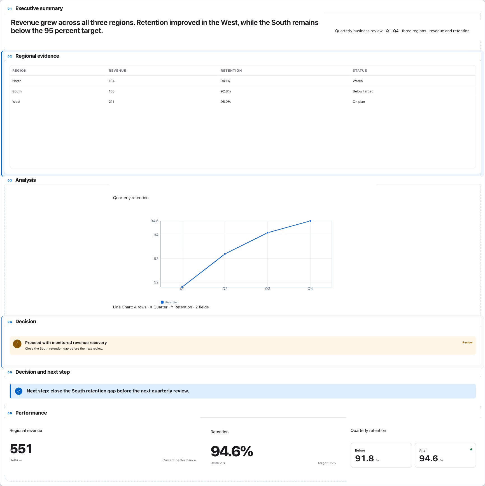
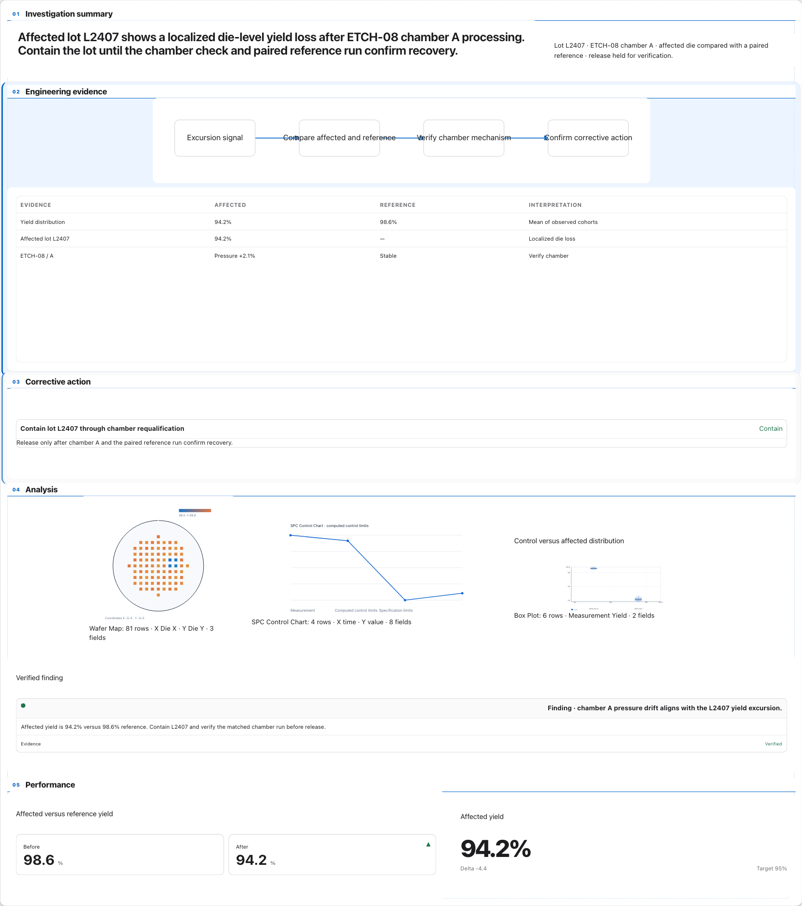
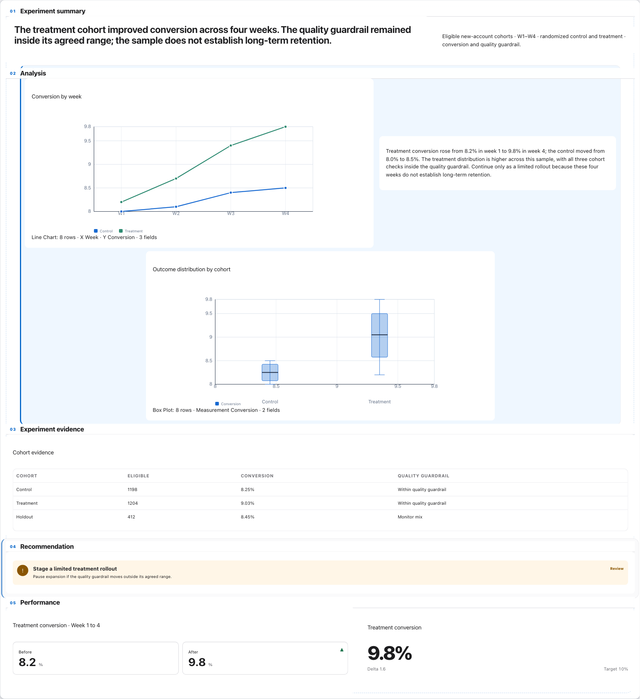
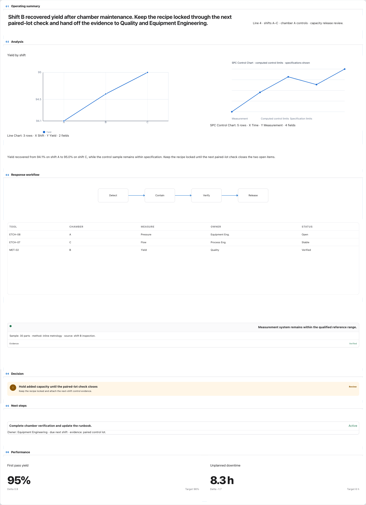
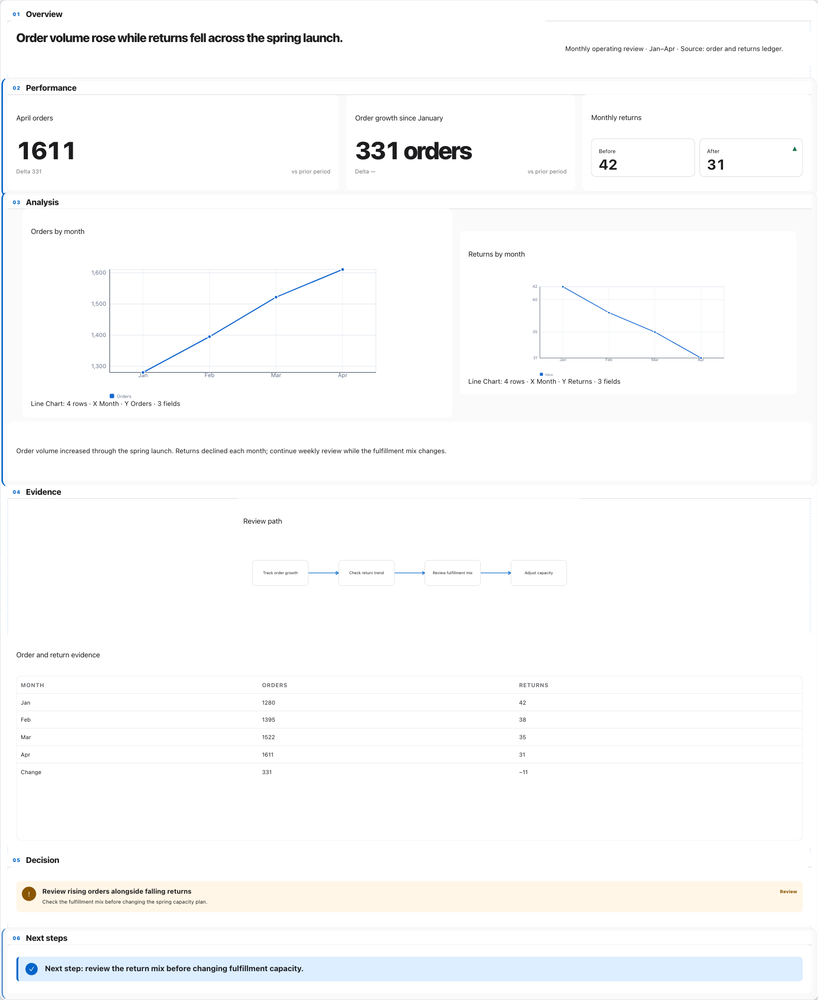
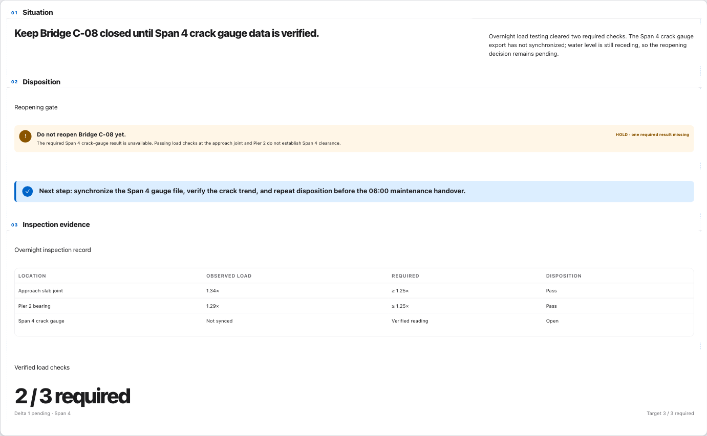

# CHG-173 R3 · Whole-report compositions

Fresh exact-main audit outcome: **NO_GO** on two material findings. Six full report canvases lead this package. View PNGs at native size or use the multipage review PDFs.

## A · Executive Business Review

[390 px](../compositions/A-executive-business-review/reading-390.png) · [Visual Director review](../visual-director/A-executive-business-review.md) · [PPTX](../compositions/A-executive-business-review/report.pptx) · [SVG](../compositions/A-executive-business-review/report.svg)

## B · Semiconductor RCA

[390 px](../compositions/B-semiconductor-rca/reading-390.png) · [320 px](../compositions/B-semiconductor-rca/reading-320.png) · [Visual Director review](../visual-director/B-semiconductor-rca.md) · [PPTX](../compositions/B-semiconductor-rca/report.pptx) · [SVG](../compositions/B-semiconductor-rca/report.svg)

## C · Experiment Decision

[390 px](../compositions/C-experiment-decision/reading-390.png) · [Visual Director review](../visual-director/C-experiment-decision.md) · [PPTX](../compositions/C-experiment-decision/report.pptx) · [SVG](../compositions/C-experiment-decision/report.svg)

## D · Technical Status Review

[390 px](../compositions/D-technical-status-review/reading-390.png) · [320 px](../compositions/D-technical-status-review/reading-320.png) · [Visual Director review](../visual-director/D-technical-status-review.md) · [PPTX](../compositions/D-technical-status-review/report.pptx) · [SVG](../compositions/D-technical-status-review/report.svg)

## E · Fresh dense mixed-evidence holdout

[390 px](../compositions/E-holdout-order-returns/reading-390.png) · [Visual Director review](../visual-director/E-holdout-order-returns.md) · [PPTX](../compositions/E-holdout-order-returns/report.pptx) · [SVG](../compositions/E-holdout-order-returns/report.svg)

## F · Fresh sparse decision-led holdout

[390 px — clipped decision evidence](../compositions/F-F-bridge-c08-sparse/reading-390.png) · [Visual Director review](../visual-director/F-F-bridge-c08-sparse.md) · [PPTX](../compositions/F-F-bridge-c08-sparse/report.pptx) · [SVG](../compositions/F-F-bridge-c08-sparse/report.svg)

## Complete reviews and receipts

- [Complete evidence bundle](../../CHG-173-r3-complete-bundle.zip) · [Bundle SHA-256](../../CHG-173-r3-complete-bundle.zip.sha256)

- [Desktop full-canvas PDF](../visual/desktop-review-six-pages.pdf) · [390 px PDF](../visual/narrow-390-review-six-pages.pdf) · [320 px B/D PDF](../visual/narrow-320-B-D-review-two-pages.pdf)
- [Desktop contact sheet](../visual/contact-sheets/desktop-1440-six-reports.png) · [390 px contact sheet](../visual/contact-sheets/narrow-390-six-reports.png) · [320 px B/D contact sheet](../visual/contact-sheets/narrow-320-dense-B-D.png)
- [Findings register](../whole-report-findings-register.json) · [Final criterion map](../final-outcome-decision.json) · [PPTX semantics](../exports/pptx-structure-semantics.json)
- [Native release report](../native-release/report.json) · [Full JUnit](../native-release/full-tests.xml)

The reports were authored through supported UI workflows with run-owned values. No source, config, test, dependency, runtime, fixture, main, or Product commit changes were made. Company-managed target certification remains separate and pending.
